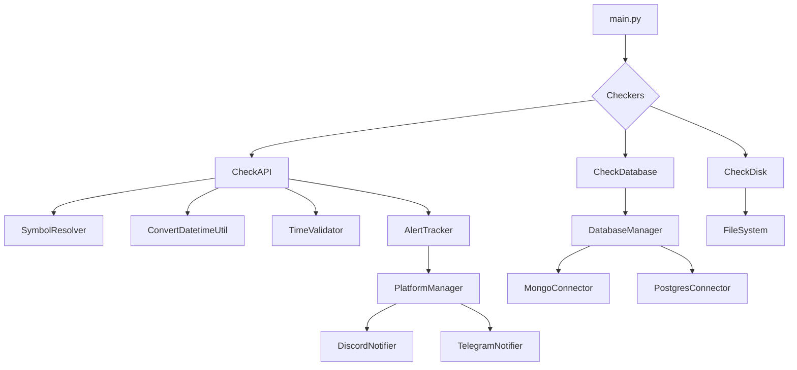

**Tổng quan dự án**

---

**QUICK START**

1) Tạo môi trường ảo và cài phụ thuộc:

```bash
python3 -m venv .venv
source .venv/bin/activate
pip install -r requirements.txt
```

2) Chạy dịch vụ (Linux/macOS):

```bash
./run.sh
# hoặc
python src/main.py
```

3) Kiểm tra log: xem thư mục `logs/`.

**MỤC LỤC README (tóm tắt)**
- Quick Start (đã có)
- Cấu hình (giải thích `configs/data_sources_config.json`)
- Modules & Luồng xử lý
- Sơ đồ kiến trúc (Mermaid)
- Vận hành & Troubleshooting
- Các bước tiếp theo (tuỳ chọn)

**CẤU HÌNH CHI TIẾT (`configs/data_sources_config.json`)**

Tổng quan: mỗi khóa top-level là một nguồn dữ liệu (ví dụ `cmc`, `vn100`). Mỗi nguồn có thể chứa một hoặc nhiều phần: `api`, `database`, `disk`, `symbols`, `check`, `schedule`.

Các trường phổ biến:

- `enabled` (boolean): bật/tắt kiểm tra cho nguồn này.
- `type` (string, tuỳ chọn): `api` | `db` | `disk` — loại nguồn chính.

- `api` (object):
  - `enable` (bool)
  - `url` (string): endpoint; có thể chứa `{symbol}`
  - `method` (string): `GET` hoặc `POST`
  - `headers` (object)
  - `params` (object)
  - `timeout_seconds` (int)
  - `record_pointer` (int): index trong array trả về (0 = first/newest theo API, -1 = last/oldest)
  - `column_to_check` (string): tên trường chứa timestamp
  - `nested_list` (bool): true nếu response có nested list

- `database` (object):
  - `enable` (bool)
  - `type` / `engine` (string): `mongodb` | `postgresql`
  - `connection_name` (string): key trỏ tới cấu hình DB trong `common_config.json`
  - `database` (string)
  - `collection_name` / `table` (string)
  - `query` (object|string): template query hoặc SQL
  - `time_field` / `column_to_check` (string)
  - `record_pointer` (int): 0 = newest, -1 = oldest

- `disk` (object):
  - `enable` (bool)
  - `file_path` (string): có thể dùng `{symbol}`
  - `file_type` (string): `json` | `csv` | `txt` | `mtime`
  - `record_pointer` (int)
  - `column_to_check` (string)

- `symbols` (object):
  - `auto_sync` (bool|null): true → lấy distinct từ DB; false → dùng `values`; null → không dùng symbol
  - `values` (array): danh sách symbol tĩnh
  - `file_path` (string): đường dẫn file chứa symbol
  - `column` (string): tên cột để lấy distinct
  - `cache_seconds` (int): thời gian cache symbols (mặc định 86400)

- `check` (object):
  - `enabled` (bool)
  - `timezone_offset` (int): giờ lệch so với UTC (mặc định 7)
  - `allow_delay` (int, seconds): khoảng cho phép
  - `check_frequency` (int, seconds)
  - `alert_frequency` (int, seconds)
  - `max_stale_seconds` (int|null)
  - `error_on_missing` (bool)
  - `time_field` / `time_format` / `time_format_string` (khi custom)

- `schedule` (object):
  - `valid_days` (array|null): [0..6], 0 = Thứ Hai
  - `time_ranges` (string|array|null): null = 24/7, hoặc "HH:MM-HH:MM" hoặc danh sách

Ví dụ rút gọn (API + symbols inline):

```json
"cmc": {
  "enabled": true,
  "api": {"enable": true, "url": "https://api.example.com/data?symbol={symbol}", "record_pointer": 0, "column_to_check": "timestamp"},
  "symbols": {"auto_sync": false, "values": ["BTC","ETH"], "cache_seconds": 86400},
  "check": {"enabled": true, "allow_delay": 1800, "check_frequency": 60, "alert_frequency": 300}
}
```

Ghi chú vận hành:
- Nếu chỉ cần API → chỉ cấu hình `api`.
- Nếu `symbols.auto_sync=true` cần cung cấp `symbols.column` và `database` để resolver lấy distinct.
- `record_pointer` phụ thuộc định dạng trả về của API / file.

**MODULES & LUỒNG XỬ LÝ (tóm tắt)**

- `src/main.py` — đọc config, khởi logger, tạo asyncio tasks cho từng checker, xử lý signal (shutdown/cleanup).
- `src/check/check_api.py` — `CheckAPI`:
  - Lấy symbols (`SymbolResolverUtil`);
  - Gọi API (theo symbol nếu cần);
  - Lấy `time_field`, parse (`ConvertDatetimeUtil`), so sánh với giờ hiện tại (`TimeValidator`);
  - `AlertTracker` quyết định gửi hay ngưng gửi;
  - `PlatformManager` gửi alert qua Discord/Telegram.
- `src/check/check_database.py` — `CheckDatabase`:
  - Dùng `DatabaseManager` để lấy connector (Mongo/Postgres);
  - Thực hiện query để lấy timestamp (MAX/MIN) theo `record_pointer`;
  - Áp cùng luồng validate/alert.
- `src/check/check_disk.py` — `CheckDisk`:
  - Đọc file (json/csv/txt hoặc mtime), parse datetime, áp luồng validate/alert.
- `src/utils/*`:
  - `LoadConfigUtil`: đọc config với caching theo mtime;
  - `SymbolResolverUtil`: resolve và cache symbols vào `cache/`;
  - `ConvertDatetimeUtil`: parse ISO, epoch, custom format;
  - `TimeValidator`: kiểm tra schedule (UTC+7 mặc định);
  - `AlertTracker`: theo dõi last alert, avoid spam;
  - `PlatformManager`: tạo và gửi tới notifier.

**SƠ ĐỒ KIẾN TRÚC (Mermaid)**



**VẬN HÀNH & TROUBLESHOOTING**

- Logs: kiểm tra `logs/` để xem chi tiết lỗi.
- Nếu không nhận được alert: kiểm tra `configs/common_config.json` (webhook/token/chat_id) và trạng thái `is_primary` trong cấu hình platform.
- Để test nhanh: giảm `check.allow_delay` hoặc `check.check_frequency` cho nguồn cần kiểm thử.
- Bảo mật: không lưu credential công khai trong repo; dùng biến môi trường hoặc secrets manager.

**TIẾP THEO (tuỳ chọn thực hiện tiếp)**

- Tạo file `configs/data_sources_config.example.json` (redacted) — tiện dùng để cấu hình môi trường.
- Thêm unit tests cho `TimeValidator` và `DataValidator`.
- Hoàn thiện ví dụ cụ thể cho từng nguồn hiện có trong repo.

Nếu cần thực hiện phần nào trong danh sách trên, gửi chỉ định hành động mong muốn.

**Sơ đồ kiến trúc**

Quan hệ chính giữa các module:

- `src/main.py` -> khởi chạy các tác vụ bất đồng bộ -> {`CheckAPI`, `CheckDatabase`, `CheckDisk`}
- `CheckAPI` -> sử dụng -> {`LoadConfigUtil`, `SymbolResolverUtil`, `ConvertDatetimeUtil`, `TimeValidator`, `DataValidator`, `AlertTracker`, `PlatformManager`}
- `CheckDatabase` -> sử dụng -> {`DatabaseManager` -> (`MongoDBConnector`, `PostgreSQLConnector`), `ConvertDatetimeUtil`, `TimeValidator`, `DataValidator`, `AlertTracker`, `PlatformManager`}
- `CheckDisk` -> sử dụng -> {`ConvertDatetimeUtil`, `TimeValidator`, `DataValidator`, `AlertTracker`, `PlatformManager`}


Utils:
- `LoadConfigUtil`: load file cấu hình JSON, caching và auto-reload khi file thay đổi
- `SymbolResolverUtil`: danh sách `symbols` (cache vào `/cache` trong 24h)
- `ConvertDatetimeUtil`: parse và chuyển đổi các dạng datetime
- `AlertTracker`: quản lý trạng thái alert (frequency, silent mode, low-activity...)
- `TaskManager`: helper tạo và chạy asyncio tasks

Lớp platform (gửi thông báo):
- `PlatformManager` tạo các notifier {`DiscordNotifier`, `TelegramNotifier`} từ `configs/common_config.json`.

Lớp database:
- `configs/database_config/*`: `BaseDatabaseConnector`, `MongoDBConnector`, `PostgreSQLConnector` và `DatabaseManager` (factory + cache connector).

**Các file chính, lớp và phương thức quan trọng**

- `src/main.py`
  - Mục đích: entrypoint. Thiết lập logging, xử lý signal và chạy `asyncio.run(main())`.
  - Hàm chính: `main()` (khởi chạy các tác vụ API/DB/Disk song song), `send_shutdown_alert()`, `signal_handler()`.

- `src/check/check_api.py`
  - Lớp: `CheckAPI`
    - `__init__`: khởi tạo logger, `TaskManager`, `PlatformManager`, cache symbols, `AlertTracker`.
    - `_load_config()`: load `data_sources_config.json` và lọc các mục có `api.enable = true`.
    - `check_data_api(api_name, api_config, symbol)`: vòng lặp async. Luồng xử lý:
      - Reload config mỗi vòng
      - Xây dựng URL (có thể format với `symbol`)
      - Kiểm tra lịch bằng `TimeValidator.is_within_valid_schedule`
      - Gọi API (requests), parse JSON (hỗ trợ wrapper và nested lists)
      - Dùng `ConvertDatetimeUtil` để parse timestamp, `DataValidator` để kiểm tra tươi mới
      - Dùng `AlertTracker` quyết định gửi alert / tránh spam
      - Gọi `PlatformManager.send_alert(...)` để gửi tới các platform primary
    - `run_api_tasks()`: quản lý task per-API hoặc per-symbol, dùng `SymbolResolverUtil.resolve_api_symbols` để lấy danh sách symbol.

- `src/check/check_database.py`
  - Lớp: `CheckDatabase`
    - Sử dụng `DatabaseManager` để tạo/get connector và `query()` lấy timestamp bản ghi mới nhất/cũ nhất
    - Có logic alert/schedule tương tự `CheckAPI`.
    - `run_database_tasks()` quản lý các task cho mỗi database hoặc mỗi symbol.

- `src/check/check_disk.py`
  - Lớp: `CheckDisk`
    - `_read_datetime_from_file(file_path, file_type, record_pointer, column_to_check)`: đọc datetime từ JSON/CSV/TXT hoặc dùng `mtime`
    - `check_data_disk(...)`: vòng lặp kiểm tra file với logic tương tự (alert, schedule)
    - `run_disk_tasks()` quản lý task cho từng file hoặc symbol

- `src/logic_check/data_validator.py`
  - Lớp: `DataValidator`
    - `is_data_fresh(data_datetime, allow_delay)` trả về `(is_fresh, overdue_seconds)`. Có xử lý đặc biệt khi dữ liệu chỉ có ngày (date-only).
    - `format_time_overdue(seconds, allow_delay_seconds)` format chuỗi thời gian dễ đọc.

- `src/logic_check/time_validator.py`
  - Lớp: `TimeValidator`
    - `is_within_valid_schedule(valid_schedule, timezone_offset=7)` hỗ trợ nhiều định dạng lịch và so sánh theo giờ VN (UTC+7).

- `src/utils/alert_tracker_util.py`
  - Lớp: `AlertTracker` quản lý trạng thái alert: `last_alert_times`, `first_stale_times`, `max_stale_exceeded`, `low_activity_symbols`, `empty_data_tracking`, v.v.
  - Phương thức chính: `should_send_alert()`, `record_alert_sent()`, `track_empty_data()`, `reset_empty_data()`, `track_stale_data()`, `track_consecutive_stale_days()`, `reset_fresh_data()`.

- `src/utils/convert_datetime_util.py`
  - Lớp: `ConvertDatetimeUtil` cung cấp parse cho ISO, `YYYY-MM-DD HH:MM:SS`, `YYYY-MM-DD`, timestamp, và `convert_utc_to_local()`.

- `src/utils/load_config_util.py`
  - Lớp: `LoadConfigUtil` quản lý đọc file JSON với caching dựa trên `mtime` và khả năng reload khi file thay đổi.

- `src/utils/symbol_resolver_util.py`
  - Lớp: `SymbolResolverUtil` giải quyết danh sách symbol theo config `symbols.auto_sync`:
    - `auto_sync = true`: tự động lấy distinct symbols từ database có cùng `api_name` (qua `DatabaseManager`), cache vào `/cache/symbols_{api}.json` trong 24 giờ.
    - `auto_sync = false`: dùng `symbols.values` từ cấu hình.
    - `auto_sync = null` hoặc không có: API không cần symbol.

- `src/utils/task_manager_util.py`
  - Lớp: `TaskManager` helper tạo và chạy các asyncio task.

- Platform utilities (`src/utils/platform_util/`)
  - `base_platform.py`: `BasePlatformNotifier` interface + helper `build_base_message_data()`
  - `discord_util.py`: `DiscordNotifier` (gửi qua webhook Discord, mong response 204 thành công)
  - `telegram_util.py`: `TelegramNotifier` (gửi qua Telegram Bot API, parse Markdown)
  - `platform_manager.py`: `PlatformManager` tạo notifier từ `configs/common_config.json` và expose `send_alert()` gửi tới tất cả platform primary.

- Database connectors (`configs/database_config/`)
  - `base_db.py`: `BaseDatabaseConnector` interface (connect, query, close, get_required_package)
  - `mongo_config.py`: `MongoDBConnector` dùng `pymongo` (connect, query, get_distinct_symbols)
  - `postgres_config.py`: `PostgreSQLConnector` dùng `psycopg2` (connect, query với MAX/MIN, get_distinct_symbols)
  - `database_manager.py`: `DatabaseManager` (factory, cache connectors, merge credential từ `common_config.json`).

**File cấu hình**

- `configs/common_config.json`
  - Chứa: `PLATFORM_CONFIG` (discord, telegram), `POSTGRE_CONFIG` (host, port, database, user, password), `MONGO_CONFIG` (host, port, username, password, auth_source).

- `configs/data_sources_config.json`
  - Mỗi khóa ở cấp top-level là một nguồn dữ liệu (ví dụ `cmc`, `etf_candlestick`, `gold-data`, `vn100`).
  - Mỗi nguồn có các phần cấu hình: `api`, `database`, `disk`, `symbols`, `check`, `schedule`.
  - `api`: {`enable`, `url`, `record_pointer`, `column_to_check`, `nested_list`} — dùng cho `CheckAPI`.
  - `database`: {`enable`, `type` (`mongodb`/`postgresql`), `database`, `collection_name`/`table`, `column_to_check`, `record_pointer`} — dùng cho `CheckDatabase`.
  - `disk`: {`enable`, `file_type`, `file_path`, `column_to_check`} — dùng cho `CheckDisk`.
  - `symbols`: {`auto_sync`: true|false|null, `values`: [...], `column`: tên cột dùng để query DISTINCT}.
  - `check`: `timezone_offset`, `allow_delay`, `check_frequency`, `alert_frequency`, `max_stale_seconds`.
  - `schedule`: `valid_days` (danh sách ngày trong tuần, 0=Thứ Hai), `time_ranges` (chuỗi hoặc danh sách `HH:MM-HH:MM`). Lịch luôn đánh giá theo giờ VN (UTC+7).

  ** chi tiết `configs/data_sources_config.json`**

Nếu chỉ muốn cấu hình một loại nguồn (ví dụ chỉ API), chỉ cần thêm phần `api` cho khóa đó — không cần phải thêm `database` hoặc `disk`.

  - `api` (object) — dùng cho `CheckAPI`:
    - `enable` (bool): bật/tắt kiểm tra API.
    - `url` (string): endpoint để gọi. Có thể chứa `{symbol}` nếu task chạy theo symbol (vd: `...?symbol={symbol}`).
    - `record_pointer` (int): chỉ mục bản ghi trong mảng trả về. `0` = bản ghi mới nhất, `-1` = bản ghi cũ nhất; cũng có thể là chỉ số khác nhưng nếu >= len(array) sẽ báo lỗi.
    - `column_to_check` (string): tên trường chứa timestamp trong record (vd: `datetime`).
    - `nested_list` (bool): `true` nếu response là nested list (ví dụ `[[{...}, ...]]`).

  Ví dụ (API-only):
  ```json
  "gold-data": {
    "api": {
      "enable": true,
      "url": "http://.../gold-data/?day=0",
      "record_pointer": 0,
      "column_to_check": "datetime"
    }
  }
  ```

  - `database` (object) — dùng cho `CheckDatabase`:
    - `enable` (bool): bật/tắt kiểm tra database.
    - `type` (string): `mongodb` hoặc `postgresql`.
    - `database` (string): tên database.
    - `collection_name` (mongodb) / `table` (postgresql): tên collection/table để query.
    - `column_to_check` (string): tên field cột chứa timestamp.
    - `record_pointer` (int): `0` = mới nhất, `-1` = cũ nhất (Mongo dùng sort, Postgres dùng MAX/MIN).

  Ví dụ (DB-only):
  ```json
  "vn100": {
    "database": {
      "enable": true,
      "type": "postgresql",
      "database": "dl_ckvn",
      "table": "vn100",
      "column_to_check": "datetime",
      "record_pointer": 0
    }
  }
  ```

  - `disk` (object) — dùng cho `CheckDisk`:
    - `enable` (bool): bật/tắt kiểm tra file.
    - `file_type` (string): `json`, `csv`, `txt`, hoặc `mtime` (dùng last-modified time).
    - `file_path` (string): đường dẫn file; có thể chứa `{symbol}` nếu file theo symbol.
    - `record_pointer` (int): 0 = mới nhất, -1 = cũ nhất (đối với json/csv/txt đọc nội dung).
    - `column_to_check` (string): tên cột trường chứa datetime (với json/csv).

  Ví dụ (disk-only):
  ```json
  "tygia": {
    "disk": {
      "enable": true,
      "file_type": "csv",
      "file_path": "/path/to/tygia.csv",
      "record_pointer": 0,
      "column_to_check": "day"
    }
  }
  ```

  - `symbols` (object) — điều khiển danh sách symbol cho nguồn cần symbol:
    - `auto_sync`: `true` → tự động lấy distinct symbols từ database có cùng tên (cần `symbols.column` và `database` config); `false` → dùng `values` thủ công; `null` → không cần symbol (nguồn 1 task duy nhất).
    - `values`: danh sách symbol thủ công (nếu `auto_sync=false`).
    - `column`: tên cột/field trong DB để lấy `DISTINCT` (bắt buộc khi `auto_sync=true`).

  Ví dụ (auto sync từ DB):
  ```json
  "cmc": {
    "symbols": { "auto_sync": true, "column": "symbol" },
    "database": { "enable": true, "type": "mongodb", "database": "cmc_db", "collection_name": "cmc" }
  }
  ```

  - `check` (object) — tham số kiểm tra / ngưỡng (tất cả theo đơn vị giây, trừ khi ghi rõ khác):
    - `timezone_offset` (int): múi giờ của dữ liệu (số giờ lệch so với UTC). Mặc định `7` (UTC+7). Hệ thống sẽ chuyển timestamp của nguồn về giờ VN trước khi so sánh nếu khác 7.
    - `allow_delay` (int, seconds): khoảng thời gian cho phép để dữ liệu được xem là "mới" (ví dụ 60 = 60s). Nếu dữ liệu cũ hơn `allow_delay` => stale.
    - `check_frequency` (int, seconds): tần suất checker sẽ chạy/kiểm tra (ví dụ 10 = mỗi 10s).
    - `alert_frequency` (int, seconds): tối thiểu giữa hai lần gửi alert (để tránh spam).
    - `max_stale_seconds` (int hoặc null): nếu tổng stale vượt quá giá trị này → gửi 1 alert cuối cùng rồi chuyển sang silent/log-only.
    - `holiday_grace_period` (int, seconds, optional): ngưỡng phụ cho phát hiện nghi ngờ ngày lễ (mặc định 7200s = 2 giờ) — dùng nội bộ trong logic holiday detection.

  Ví dụ `check`:
  ```json
  "check": { "timezone_offset": 7, "allow_delay": 60, "check_frequency": 10, "alert_frequency": 60, "max_stale_seconds": 604800 }
  ```

  - `schedule` (object or list) — lịch cho phép kiểm tra (theo giờ VN UTC+7):
    - `valid_days`: danh sách số nguyên 0..6 (0 = Thứ Hai, 6 = Chủ Nhật). `null` hoặc không set = mọi ngày.
    - `time_ranges`: `null` = 24/7, hoặc chuỗi `"HH:MM-HH:MM"` hoặc danh sách các chuỗi (ví dụ `["09:00-11:30","13:00-14:30"]`). Nếu `time_ranges` là list, chỉ cần 1 trong các khoảng hợp lệ.

  Ví dụ (chỉ chạy giờ giao dịch):
  ```json
  "schedule": { "valid_days": [0,1,2,3,4], "time_ranges": ["09:00-11:30", "13:00-14:30"] }
  ```

  Ghi chú quan trọng:
  - Nếu một nguồn chỉ cần check API (ví dụ `gold-data`), chỉ cần cung cấp phần `api` cho khóa đó; phần `database` và `disk` có thể để không cần ghi vào config.
  - `symbols.auto_sync=true` yêu cầu `symbols.column` và phần `database` phải cấu hình đúng (collection/table và database). Nếu không có, resolver sẽ trả `[]` và task sẽ bị bỏ qua.
  - `record_pointer` Bản ghi nằm ở vị trí nào trong mảng trả về từ data API: `0` thường trỏ tới bản ghi mới nhất nếu API trả mảng theo thứ tự mới->cũ; `-1` dùng khi cần lấy bản ghi cũ nhất.
  - `nested_list=true` dùng khi API trả dữ liệu dạng nested list (ví dụ `[[{...},...]]`) hoặc wrapper có `data: [[...]]`.

  Ví dụ tổng hợp (api + db + symbols auto-sync):
  ```json
  "cmc": {
    "api": { "enable": true, "url": "http://.../cmc/?symbol={symbol}&day=0", "record_pointer": 0, "column_to_check": "datetime" },
    "database": { "enable": true, "type": "mongodb", "database": "cmc_db", "collection_name": "cmc", "column_to_check": "datetime" },
    "symbols": { "auto_sync": true, "column": "symbol" },
    "check": { "timezone_offset": 0, "allow_delay": 1800, "check_frequency": 60, "alert_frequency": 60 }
  }
  ```
**Luồng hoạt động**

- `src/main.py` khởi song song `CheckAPI`, `CheckDatabase`, `CheckDisk`.
- Mỗi checker load config động từ `data_sources_config.json` (qua `LoadConfigUtil`) và tạo/cancel tasks theo config.
- `SymbolResolverUtil` giải quyết symbol (auto-sync từ DB hoặc dùng giá trị thủ công).
- `DatabaseManager` quản lý kết nối DB, delegating tới `MongoDBConnector` hoặc `PostgreSQLConnector` để query timestamp.
- `AlertTracker` kiểm soát tần suất gửi alert, silent mode, low-activity detection.
- `PlatformManager` gửi thông báo tới các platform được đánh dấu `is_primary` trong `common_config.json`.

**Hướng dẫn chạy**

Yêu cầu trước khi chạy:
- Python 3.8+ (workspace mẫu dùng Python 3.10)
- Cài dependencies trong `requirements.txt`

Khởi chạy nhanh (Linux):
```bash
**QUICK START — CHẠY NHANH**

1) Tạo môi trường ảo và cài phụ thuộc:

```bash
python3 -m venv .venv
source .venv/bin/activate
pip install -r requirements.txt
```

2) Chạy dịch vụ (linux/mac):

```bash
./run.sh
# hoặc
python src/main.py
```

3) Kiểm tra logs: thư mục `logs/` chứa file log quay vòng (RotatingFileHandler).

**CẤU HÌNH (TỔNG QUAN)**

- File chính: `configs/common_config.json` — chứa thông tin nền tảng thông báo (Discord webhook, Telegram token/chat_id) và cấu hình DB chung.
- File chuyên biệt: `configs/data_sources_config.json` — danh sách các nguồn dữ liệu (mỗi nguồn có các trường `api`, `database`, `disk`, `symbols`, `check`, `schedule`).

Phần dưới đây giải thích chi tiết từng trường trong `configs/data_sources_config.json` (mẫu và ý nghĩa).

**Giải thích `configs/data_sources_config.json` (chi tiết)**

Mỗi entry (ví dụ `cmc`, `vn100`) là một nguồn dữ liệu. Cấu trúc phổ biến:

- `enabled` (boolean): bật/tắt kiểm tra cho nguồn này.
- `type` (string, optional): `api` | `db` | `disk` — loại nguồn chính.
- `api` (object, khi `type` là `api` hoặc cần gọi HTTP):
  - `url`: endpoint
  - `method`: `GET` | `POST`
  - `headers`: object
  - `params`: object (được nối vào query string)
  - `timeout_seconds`: số giây chờ

- `database` (object, khi kiểm tra từ DB):
  - `engine`: `mongo` | `postgres`
  - `connection_name`: tên khóa trỏ tới `configs/common_config.json` (ví dụ `MONGO_CONFIG`)
  - `collection` / `table`: nơi query
  - `query`: object hoặc SQL string (tùy engine)
  - `time_field`: tên trường chứa timestamp

- `disk` (object, khi đọc file):
  - `path`: đường dẫn tới file hoặc thư mục
  - `format`: `json` | `csv` | `txt` | `mtime` (mtime = dùng thời gian sửa file)
  - `match_pattern`: (tuỳ chọn) glob pattern

- `symbols` (object): định nghĩa danh sách symbols để kiểm tra
  - `mode`: `inline` | `file` | `cmc` | `db`
  - `list`: ["SYM1", "SYM2"] (khi `inline`)
  - `file_path`: đường dẫn file chứa symbols (khi `file`)
  - `cache_seconds`: thời gian cache symbols (mặc định 86400 — 24h)

- `check` (object): luật kiểm tra
  - `enabled`: boolean
  - `time_field`: tên trường datetime trong payload (ví dụ `timestamp`)
  - `time_format`: `iso` | `unix` | `custom` (khi custom cần `time_format_string`)
  - `threshold_minutes`: quá trình được coi là "cũ" nếu timestamp cách thời điểm hiện tại quá giá trị này (phút)
  - `error_on_missing`: boolean — nếu true và không tìm thấy record => cảnh báo

- `schedule` (object): lịch kiểm tra
  - `interval_seconds`: tần suất chạy (mặc định 300)
  - `at_times`: ["09:00","12:00"] — các thời điểm cố định trong ngày (tùy chọn)

Ví dụ một entry rút gọn:

```json
"cmc": {
  "enabled": true,
  "type": "api",
  "api": {
    "url": "https://api.example.com/data",
    "method": "GET",
    "timeout_seconds": 10
  },
  "symbols": {
    "mode": "inline",
    "list": ["BTC","ETH"],
    "cache_seconds": 86400
  },
  "check": {
    "enabled": true,
    "time_field": "timestamp",
    "time_format": "iso",
    "threshold_minutes": 30,
    "error_on_missing": true
  },
  "schedule": {"interval_seconds": 300}
}
```

Ghi chú:
- Một số nguồn chỉ cần `api`, một số khác cần `database` hoặc `disk`.
- Trường `symbols` cho phép lấy danh sách động (từ file, từ API như CMC, hoặc inline). Hệ thống cache symbols trong thư mục `cache/` để giảm tải.

**MODULES & LUỒNG XỬ LÝ (TÓM TẮT)**

- `src/main.py` — entrypoint: đọc config, khởi logger, tạo tasks cho từng checker và xử lý signal (shutdown / restart alert).
- `src/check/check_api.py` — `CheckAPI`: for each source:
  - lấy danh sách symbols (`SymbolResolverUtil`),
  - gọi HTTP (`api`), parse trả về, lấy giá trị `time_field`,
  - chuyển format (`ConvertDatetimeUtil`) → so sánh với giờ hiện tại (`TimeValidator`),
  - nếu vi phạm threshold ⇒ `AlertTracker` quyết định có gửi hay bỏ qua ⇒ `PlatformManager` gửi thông báo.
- `src/check/check_database.py` — `CheckDatabase`: kết nối qua `DatabaseManager` (factory), thực hiện query để lấy timestamp lớn nhất/nhỏ nhất, áp cùng logic `TimeValidator`/`AlertTracker`.
- `src/check/check_disk.py` — `CheckDisk`: đọc file/mtime, apply same validation.
- `src/utils/*`:
  - `LoadConfigUtil`: đọc config JSON với caching & reload on change.
  - `SymbolResolverUtil`: resolve symbols + cache vào `cache/`.
  - `ConvertDatetimeUtil`: parse nhiều dạng timestamp.
  - `TimeValidator`: so sánh datetime với threshold (hỗ trợ timezone VN+7 mặc định).
  - `AlertTracker`: throttle/avoid duplicate alerts.
  - `PlatformManager` + `platform_util/*`: tạo notifier cho Discord/Telegram.